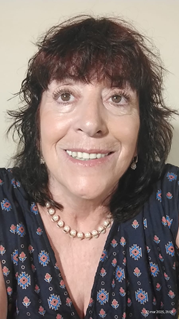

# Programación con objetos I
## Presentación Personal

### Datos Personales
- Mi nombre es Norma Gomez
- Vivo en Castelar
- Estudié Bachiller con Orientación Docente
- Hice tres años de Bioquímica en la UBA
- Estudio Tecnicatura en programación
- Toda mi vida trabajé en Consultorias de Investigación de Mercado y Opinión Pública
- Desde el 2009 tengo mi propia Consultora que se llama NHG Consultora
  

  

### Otra Información
La investigación de mercado ha evolucionado significativamente en los últimos años. 
Estoy explorando una nueva etapa profesional que combine mi conocimiento del sector con las herramientas tecnológicas actuales. 
Aspiro a desarrollar soluciones y aplicaciones que optimicen la recopilación, el análisis y la visualización de datos de mercado. 
Mi objetivo es ofrecer servicios de consultoría que integren mi experiencia en investigación con nuevas competencias en programación, y así ayudar a las empresas a incorporar tecnologías innovadoras en sus procesos de toma de decisiones.
